# VishAI - Multi-Agent Mental Health Support System

[](https://azure.microsoft.com)
[](https://azure.microsoft.com/products/ai-services/openai-service)
[](https://docs.microsoft.com/azure/mcp)
[](LICENSE)
[](https://github.com/ToshikSoni/JS-AI_VishAI)

> **🏆 AI Dev Days Hackathon 2026 Submission**
> 
> An advanced multi-agent AI system providing compassionate, specialized mental health support through intelligent orchestration powered by Azure MCP (Model Context Protocol).

## 🌟 Hero Technologies

- **Azure MCP** - 5 specialized tools + 4 resource collections for agent knowledge
- **Microsoft Agent Framework** - 4 specialized AI agents with intelligent routing
- **Azure OpenAI (GPT-4o)** - With audio modalities for voice interaction
- **Azure Cosmos DB** - Persistent conversation storage
- **Azure Key Vault** - Secure secrets management
- **GitHub Copilot** - AI-assisted development

## 🎯 The Problem

- **40%** of adults report anxiety or depression symptoms
- Mental health services are **inaccessible** for many (cost, stigma, availability)
- Crisis situations require **immediate, informed responses**
- One-size-fits-all chatbots lack **specialized expertise**

## 💡 Our Solution

A **multi-agent AI system** where specialized agents (🚨 Crisis Counselor, 🧠 CBT Therapist, 🧘 Mindfulness Coach, 💙 Companion) collaborate through Azure MCP to provide expert, context-aware mental health support 24/7.

## ✨ Features

### Multi-Agent System
- **🚨 Crisis Counselor Agent** - Immediate crisis intervention & suicide prevention
- **🧠 CBT Therapist Agent** - Evidence-based cognitive behavioral therapy  
- **🧘 Mindfulness Coach Agent** - Breathing exercises, meditation, grounding
- **💙 Companion Agent** - General emotional support & active listening
- **Intelligent Routing** - Automatic agent selection based on message content
- **Agent Handoffs** - Smooth transitions between specialists

### Azure MCP Integration
- **5 MCP Tools**: Crisis assessment, resource lookup, CBT techniques, coping strategies, mental health topics
- **4 Resource Collections**: Crisis resources, CBT techniques, coping strategies, knowledge base
- **Real-time Knowledge Access** - Agents query MCP server for domain expertise

### User Experience
- **3D Avatar** - Emotion-driven expressions using Three.js + VRM
- **Voice Interaction** - Full voice chat with Azure OpenAI audio
- **Agent Badges** - Visual indicators showing which specialist is helping
- **Crisis Detection** - Automatic crisis detection with immediate resources
- **Mobile Responsive** - Works seamlessly on all devices

### Enterprise Features
- **Azure Cosmos DB** - Persistent conversation history (30-day retention)
- **Azure Key Vault** - Secure secrets management
- **Content Safety** - Responsible AI with Azure Content Safety API
- **Privacy-First** - GDPR/CCPA compliant, see [PRIVACY.md](PRIVACY.md)
- **Monitoring** - Azure Application Insights integration
- **CI/CD** - Automated deployment with GitHub Actions

## 🏗️ Architecture

```mermaid
graph TB
    UI[Frontend: Lit + Three.js] --> API[Backend API]
    API --> Orchestrator[Agent Orchestrator]
    Orchestrator --> Crisis[🚨 Crisis Agent]
    Orchestrator --> CBT[🧠 CBT Agent]
    Orchestrator --> Mind[🧘 Mindfulness Agent]
    Orchestrator --> Comp[💙 Companion Agent]
    Crisis & CBT & Mind & Comp --> MCP[Azure MCP Server]
    MCP --> Tools[5 MCP Tools]
    MCP --> Resources[4 Resource Collections]
    API --> OpenAI[Azure OpenAI GPT-4o]
    API --> Cosmos[(Azure Cosmos DB)]
    API --> KeyVault[Azure Key Vault]
```



Full diagram: [HACKATHON.md](HACKATHON.md#architecture-diagram)

## 🚀 Quick Start

### Prerequisites

- Node.js 20.x or higher
- Azure subscription ([Free trial](https://azure.microsoft.com/free/))
- Azure OpenAI access (GPT-4o deployment)

### Local Development

```bash
# Clone repository
git clone https://github.com/ToshikSoni/JS-AI_VishAI
cd JS-AI_VishAI
git checkout Avatar  # Development branch with all features

# Setup environment variables
cp .env.example .env
# Edit .env with your Azure credentials:
# AZURE_INFERENCE_SDK_KEY=<your-key>
# INSTANCE_NAME=<your-instance>
# DEPLOYMENT_NAME=gpt-4o

# Install dependencies and start services
cd packages/mcp-server && npm install && npm start     # Terminal 1 (Port 3001)
cd packages/webapi && npm install && npm start         # Terminal 2 (Port 3000)
cd packages/webapp && npm install && npm run dev       # Terminal 3 (Port 5173)

# Open browser
open http://localhost:5173
```

**Test Agent Routing:**
- "I want to die" → 🚨 Crisis Counselor
- "I can't stop overthinking" → 🧠 CBT Therapist  
- "I'm having a panic attack" → 🧘 Mindfulness Coach
- "I feel stressed" → 💙 Companion

## ☁️ Azure Deployment

See detailed deployment guide: [DEPLOYMENT.md](DEPLOYMENT.md)

**Quick Deploy:**

```bash
# Login to Azure
az login

# Create resources and deploy
az group create --name vishai-rg --location westus2
az deployment group create --resource-group vishai-rg --template-file azure-deploy.yml

# Or use Docker
docker-compose up --build
```

## 📚 Documentation

- **[HACKATHON.md](HACKATHON.md)** - Complete hackathon submission details
- **[DEPLOYMENT.md](DEPLOYMENT.md)** - Azure deployment guide
- **[PRIVACY.md](PRIVACY.md)** - Privacy policy & data handling
- **[QUICKSTART.md](QUICKSTART.md)** - Quick testing guide
- **[AVATAR_DOCUMENTATION.md](AVATAR_DOCUMENTATION.md)** - 3D avatar technical docs

## 🎬 Demo Video

> **📹 Coming Soon** - 2-minute demo showing crisis detection, agent switching, and MCP integration

## 🏆 Hackathon Categories

### Primary Target
**Best Multi-Agent System** - 4 specialized agents with intelligent orchestration and Azure MCP integration

### Secondary Targets  
- Grand Prize: Build AI Applications & Agents
- Best Azure Integration
- Best Enterprise Solution

See full judging criteria analysis: [HACKATHON.md](HACKATHON.md#judging-criteria)

## 🛡️ Responsible AI

VishAI implements Microsoft's Responsible AI principles:

- **Content Safety** - Azure Content Safety API for moderation
- **Privacy** - GDPR/CCPA compliant, minimal data collection
- **Transparency** - Agent badges show which specialist is active
- **Not Medical Advice** - Clear disclaimers, crisis resources provided
- **Human Oversight** - Encourages professional help for serious issues

## 🤝 Contributing

This is a hackathon project, but contributions welcome! See [CONTRIBUTING.md](CONTRIBUTING.md) for guidelines.

## 📄 License

AGPL-3.0 - See [LICENSE](LICENSE)

##

### Update client initialization
Initialize LangChain's `AzureChatOpenAI` model client by replacing:

```javascript
const client = ModelClient(
  process.env.AZURE_INFERENCE_SDK_ENDPOINT,
  new AzureKeyCredential(process.env.AZURE_INFERENCE_SDK_KEY)
);
```

with:

```javascript
const chatModel = new AzureChatOpenAI({
  azureOpenAIApiKey: process.env.AZURE_INFERENCE_SDK_KEY,
  azureOpenAIApiInstanceName: process.env.INSTANCE_NAME, // In target url: https://<INSTANCE_NAME>.services...
  azureOpenAIApiDeploymentName: process.env.DEPLOYMENT_NAME, // i.e "gpt-4o"
  azureOpenAIApiVersion: "2024-08-01-preview", // In target url: ...<VERSION>
  temperature: 1,
  maxTokens: 4096,
});
```

> [!Note]
> Update your `.env` with the missing variables 

### Update chat endpoint

Replace the Azure REST SDK api call logic in the try-catch block (_app.post("/chat")_) with the following code:

```javascript
  try {
    const response = await chatModel.invoke(messages);
    res.json({ reply: response.content });
  } catch (err) {
    console.error(err);
    res.status(500).json({
      error: "Model call failed",
      message: err.message,
      reply: "Sorry, I encountered an error. Please try again."
    });
  }
```

### Test the integration

Restart the server to confirm the changes are working. 

## Step 2️⃣: Add conversation memory

Currently, the chat model does not remember previous messages. For example, if you send a message like _"Hey, you can call me Terry. What should I call you?"_

Then ask the model _"Quiz time. What's my name?"_. The model will not remember your name because your name is not passed to the model in the prompt.


To add memory, you will use LangChain's built-in memory modules - `ChatMessageHistory` and `ConversationSummaryMemory`. Conversation memory allows the AI to reference previous exchanges in a session, enabling more context-aware and coherent responses and LangChain.js provides built-in memory modules that make this easy to implement. With LangChain, you can implement stateful AI app experiences without manually managing chat logs, and you can easily switch between in-memory, Redis, or other storage options.


### How it would work in your app

- Each user session (or conversation) maintains a history of messages.
- When a user sends a new message, the backend includes previous exchanges from that session in the prompt.
- The AI can reference earlier questions and answers, making the chat feel more natural and intelligent.

### Update imports

Add the following imports to the top of your `server.js` file:

```javascript
import { BufferMemory } from "langchain/memory";
import { ChatMessageHistory } from "langchain/stores/message/in_memory";
```

### Set up session-based in-memory store

Store session histories, allowing you to maintain separate chat histories for different users or sessions.

```javascript
const sessionMemories = {};
```

### Add a helper function to get/create a session history

This utility function will check if a session history already exists for a given session ID. If it doesn't, it will create a new one.

```javascript
function getSessionMemory(sessionId) {
  if (!sessionMemories[sessionId]) {
    const history = new ChatMessageHistory();
    sessionMemories[sessionId] = new BufferMemory({
      chatHistory: history,
      returnMessages: true,
      memoryKey: "chat_history",
    });
  }
  return sessionMemories[sessionId];
}
```

### Update the chat endpoint

Lastly, you'll update the /chat handler to fetch session memory and load the chat history. Before sending the prompt to the model, the chat history will be added to the messages array so that the AI has context when generating the next reply. You then save the latest user message and model response to the session memory.

```javascript
app.post("/chat", async (req, res) => {
  const userMessage = req.body.message;
  const useRAG = req.body.useRAG === undefined ? true : req.body.useRAG;
  const sessionId = req.body.sessionId || "default";

  let sources = [];

  const memory = getSessionMemory(sessionId);
  const memoryVars = await memory.loadMemoryVariables({});

  if (useRAG) {
    await loadPDF();
    sources = retrieveRelevantContent(userMessage);
  }

  // Prepare system prompt
  const systemMessage = useRAG
    ? {
        role: "system",
        content: sources.length > 0
          ? `You are a helpful assistant for Contoso Electronics. You must ONLY use the information provided below to answer.\n\n--- EMPLOYEE HANDBOOK EXCERPTS ---\n${sources.join('\n\n')}\n--- END OF EXCERPTS ---`
          : `You are a helpful assistant for Contoso Electronics. The excerpts do not contain relevant information for this question. Reply politely: \"I'm sorry, I don't know. The employee handbook does not contain information about that.\"`,
      }
    : {
        role: "system",
        content: "You are a helpful and knowledgeable assistant. Answer the user's questions concisely and informatively.",
      };

  try {
    // Build final messages array
    const messages = [
      systemMessage,
      ...(memoryVars.chat_history || []),
      { role: "user", content: userMessage },
    ];

    const response = await chatModel.invoke(messages);

    await memory.saveContext({ input: userMessage }, { output: response.content });

    res.json({ reply: response.content, sources });
  } catch (err) {
    console.error(err);
    res.status(500).json({
      error: "Model call failed",
      message: err.message,
      reply: "Sorry, I encountered an error. Please try again."
    });
  }
});
```

To test this, open the chat UI in your browser and send a message like _"Hey, you can call me Terry. What should I call you?"_ and then ask _"Quiz time. What's my name?"_. The model should remember your name.

  

## ✅ Activity: Push your updated code to the repository

### Quest Checklist

To complete this quest and **AUTOMATICALLY UPDATE** your progress, you MUST push your code to the repository as described below.

**Checklist**

- [ ] Have a `@langchain/azure-openai` dependency in your package.json in the webapi directory

1. In the terminal, run the following commands to add, commit, and push your changes to the repository:

    ```bash
    git add .
    git commit -m "Updated to use LangChain.js and added conversation memory"
    git push
    ```

2.  After pushing your changes, **WAIT ABOUT 15 SECONDS FOR GITHUB ACTIONS TO UPDATE YOUR README**.

> To skip this quest and select a different one, click this button:
>
> [](../../issues/new?title=Skip+quest&labels=reset-quest&body=🔄+I+want+to+reset+my+AI+learning+quest+and+start+from+the+beginning.%0A%0A**Please+wait+about+15+seconds.+Your+progress+will+be+reset,+this+issue+will+automatically+close,+and+you+will+be+taken+back+to+the+Welcome+step+to+select+a+new+quest.**)

## 📚 Further Reading

Here are some additional resources to help you learn more about LangChain.js and its features:
- [Get started with Serverless AI Chat with RAG using LangChain.js](https://github.com/Azure-Samples/serverless-chat-langchainjs)
- [LangChain.js x Microsoft docs](https://js.langchain.com/docs/integrations/platforms/microsoft/)
- [Ask YouTube: LangChain.js + Azure Quickstart](https://github.com/Azure-Samples/langchainjs-quickstart-demo)
- [LangChain.js + Azure: A Generative AI App Journey](https://techcommunity.microsoft.com/blog/educatordeveloperblog/langchain-js--azure-a-generative-ai-app-journey/4101258)
- [LangChain.js docs](https://js.langchain.com/docs/introduction/)


